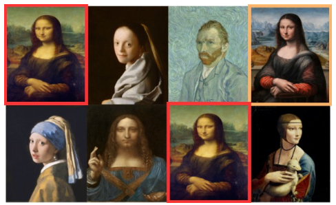
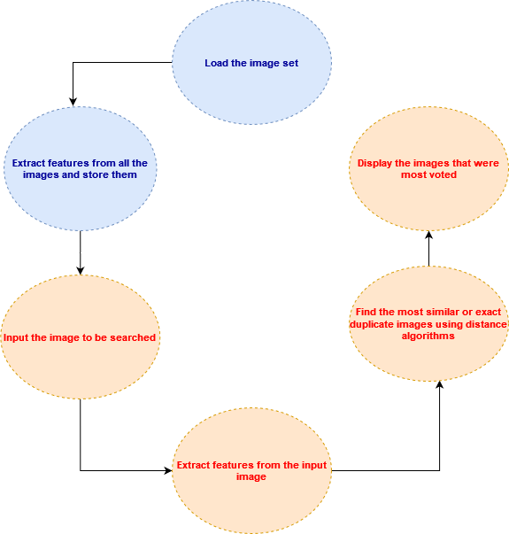
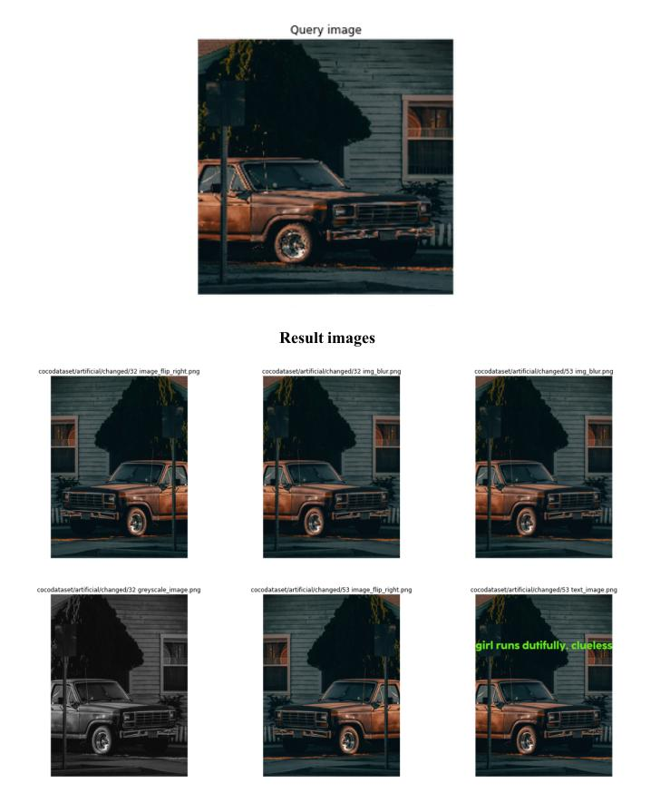
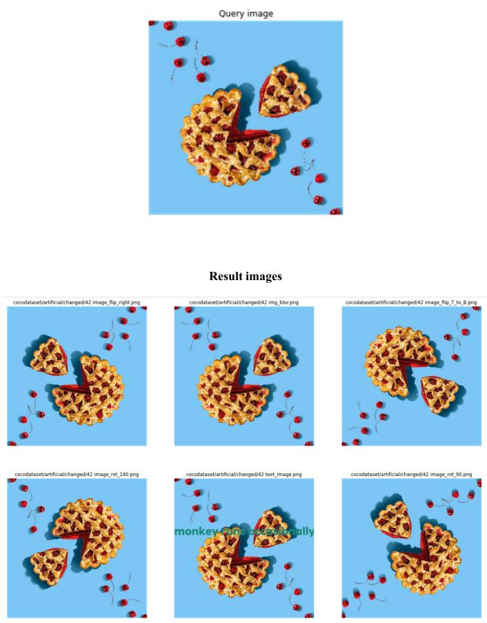
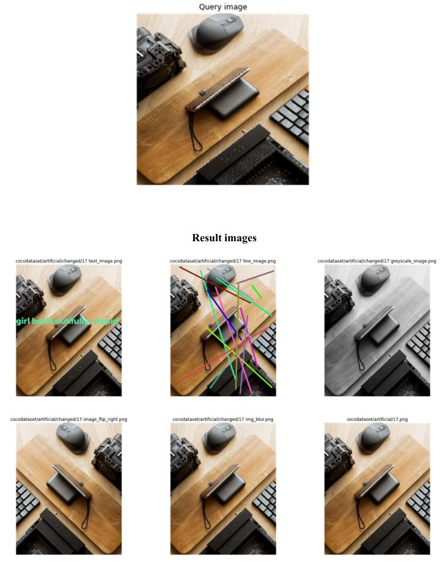
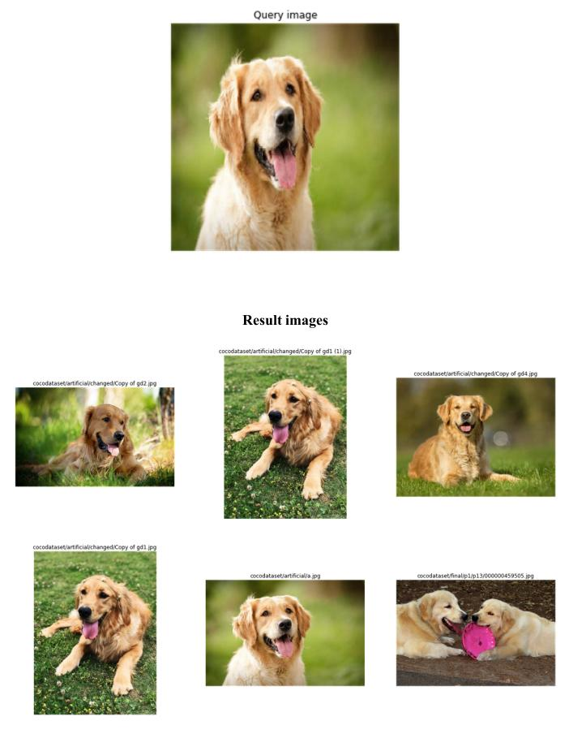
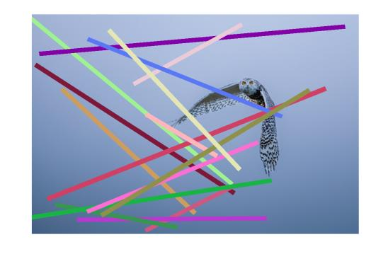
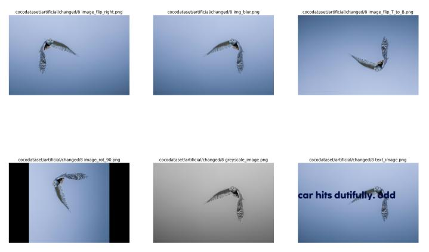
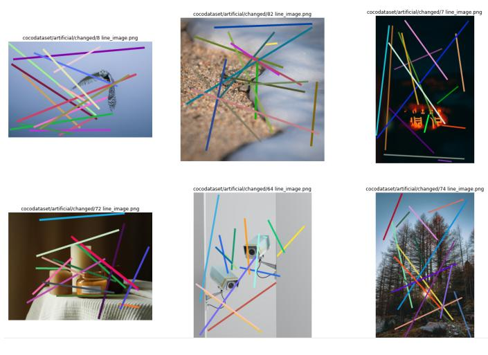
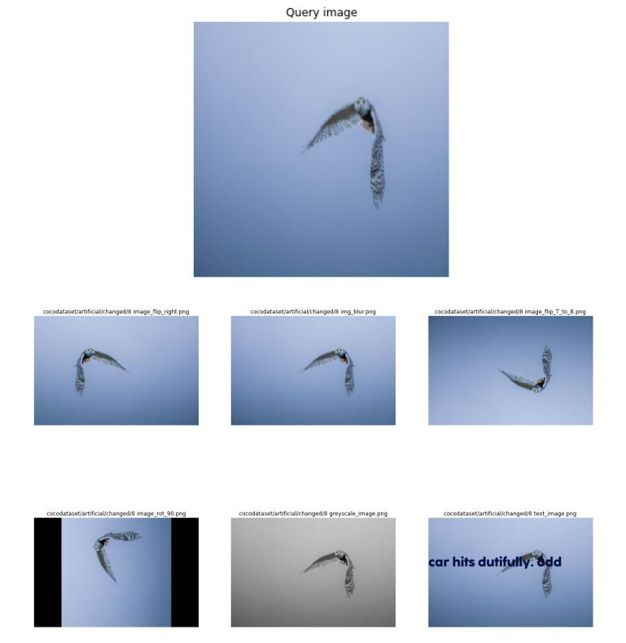

# DeDup

<h2>Introduction</h2>

  

This project was implemented towards the end of 2021, inspired by <a href="https://www.apple.com/child-safety/pdf/CSAM_Detection_Technical_Summary.pdf">Apple's CSAM</a> which was introduced a bit earlier the same year.

The task of finding exact duplicates and near-duplicate images from a given set of images is a computationally intensive task.
  Although humans may find it easier to classify images as duplicates or completely different just with a glance, machines aren’t blessed with such cognitive skills. Additionally, as the image set becomes larger with thousands or even millions of images, it is very difficult as well as mundane to go through the image set and identify the duplicates one by one.

During the course of training machine learning algorithms, having duplicate images in the training dataset proves to be a hindrance since it may make the resulting model biased towards a certain set of images.
Hashing techniques are often prescribed as a way to identify duplicate files since files with exact content only will have the identical hash. However, it is not possible to identify <i>similar images</i> with the conventional hashing technique. Hashing techniques like wavelet hashing or perceptual hashing are capable of identifying similar images.

However, this project aims to identify exact duplicates as well as near-duplicates and similar images using neural networks.

<h2>Working</h2>

The first step is to identify the image dataset and iterate over the images one by one and provide them as input to the neural network. The penultimate layer of the VGG16 network outputs a 4096 length array vector which is basically the activations for the given image. It can also be called a feature vector corresponding to that particular image. Every image will contribute a feature vector. All the feature vectors could be stored locally since iterating over each image from a dataset containing thousands of images every time will prove to be very time-consuming.

The next step is to provide an image to the network. As previously done, the network would output a feature vector corresponding to that image. To identify duplicates or near-duplicates, we need to look for the exact or the closest feature vectors to our feature vector. This can be achieved using different distance algorithms: 
  <ol>
  <li>Euclidean distance </li> 
  <li>Manhattan distance </li>
  <li>Cosine distance </li>
  <li>Minkowski distance </li>
  <li>Sorensen-Dice distance</li>
  </ol>

There is no perfect distance algorithm. An optimum algorithm will vary from the case to case. Therefore, instead of solely relying on a single algorithm for finding the exact and similar images, we are using a polling method where we first identify the most similar images using each algorithm separately. Then, we create a new ordered list with the most voted images from all of the distance algorithms

Using each of the above-mentioned distance algorithms, we identify the top five similar images for each distance algorithm. Once this is done, the top most similar images are identified based on the number of times they were identified as similar in the different distance algorithms. This final set of images can be assumed to be the most similar images to the input image.

The image dataset used is subset of COCO - Common Objects in Context (1,23,000 images) containing 92,424 images.
Actual code can be viewed inside Jupyter notebook <a href="Stage_II.ipynb">here</a>.

<h2>Results</h2>

 

 

 

 

When the below image was given as the input image, the resulting images were a bit unexpected.

It would be expected that the model should be able to find other exact duplicates as well as similar images having an owl as the subject. Some similar
images that are a part of the dataset are: 

However, the results were images having a similar pattern of randomly aligned colourful bars.

Whereas, if that same image without the colorful bars were to be provided as an input to the model, we get reasonable results. This highlights that certain features of the image dominate over others, perhaps need a way to convey to the model which feature needs to be <i>more focused upon</i>.

<h2>Remarks</h2>

A diverse set of images were given as input to the neural network and the network was able to find most of the duplicates as well as near-duplicate images that were present in the dataset.

In some instances, it didn't find all the duplicates due to the images having too many features which probably confused the model a bit.

It is clearly evident from the previously displayed results that on most occasions, the model found exact duplicates as well as similar images except on certain instances where the input image consists of a lot of image subjects. Even in that case, the results are similar images having similar patterns except that they may not be as we would have expected them to be.

